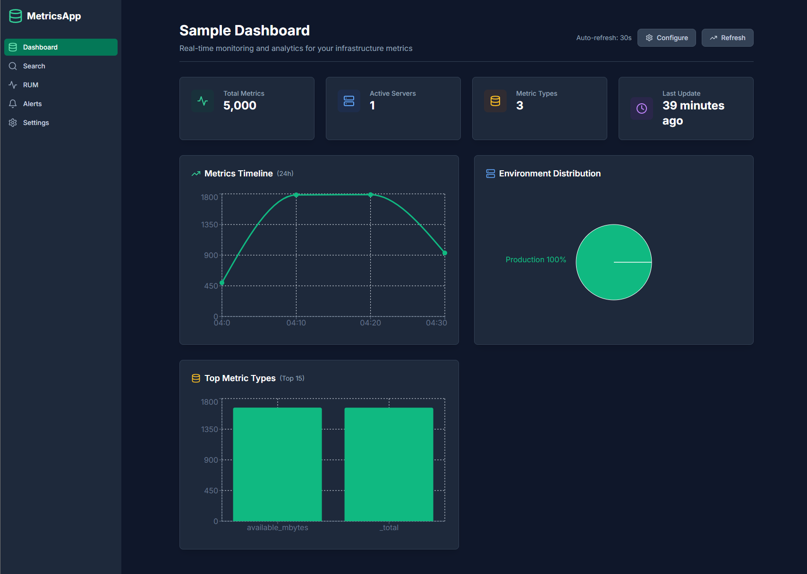
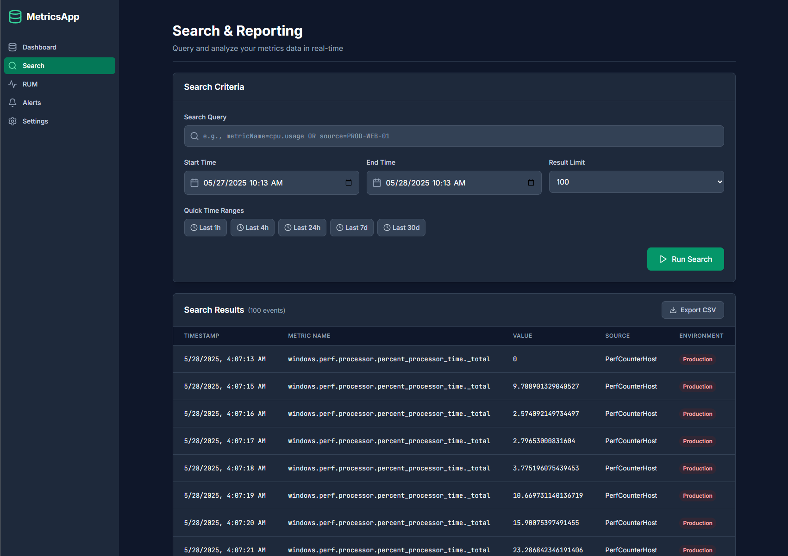
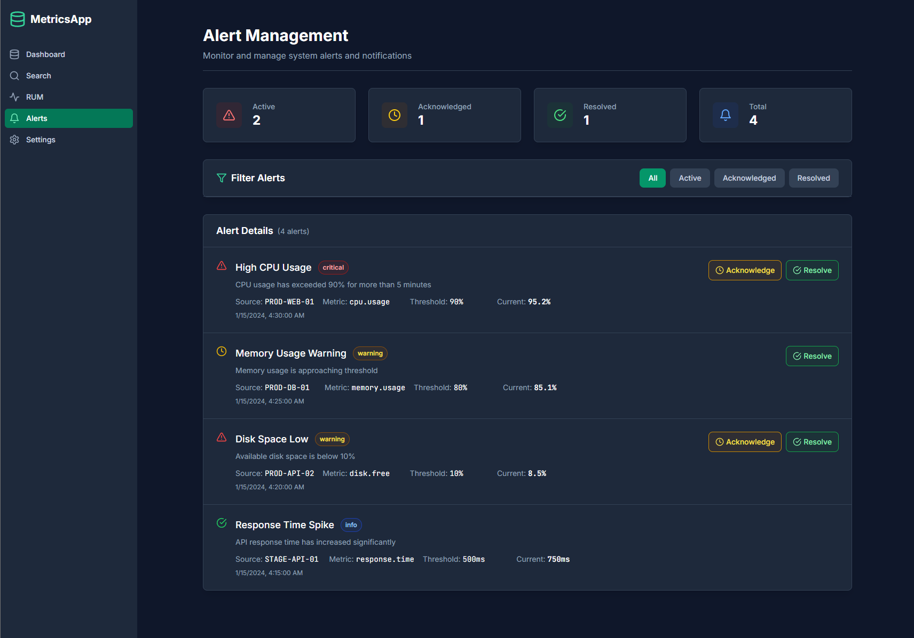
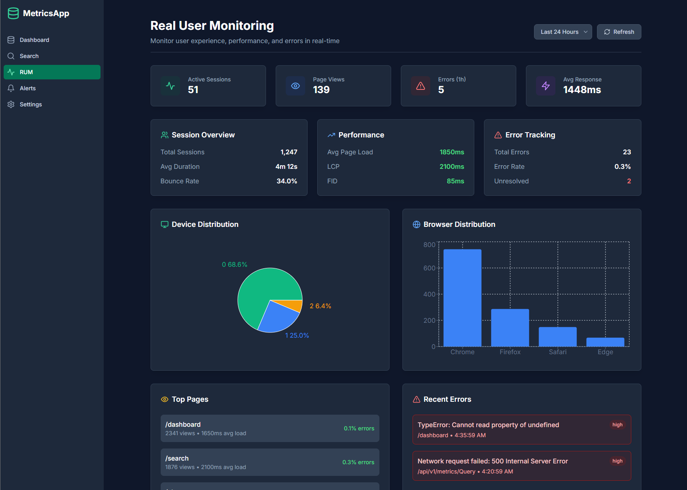

# MetricsApp WebUI (WIP)

A modern, responsive web interface for monitoring and analyzing infrastructure metrics. Built with React, TypeScript, and Tailwind CSS, featuring real-time data visualization and configurable dashboards.

## Features

### 🎯 Core Functionality
- **Real-time Dashboard**: Live metrics visualization with auto-refresh
- **Advanced Search**: Query and filter metrics with time range selection
- **Alert Management**: Monitor and manage system alerts
- **Settings Configuration**: Customize API endpoints and preferences
- **Dark Mode**: Persistent theme switching with system preference detection

### 📊 Dashboard Configuration System
- **Multi-tenant Support** (WIP): Different dashboard configurations for various organizational needs
- **Configurable Charts**: Enable/disable and customize individual chart components
- **Theme Support**: Default, Corporate, and Minimal themes with custom color schemes
- **Flexible KPIs**: Customizable key performance indicators with different formats
- **Time Range Controls**: Configurable data time windows (30m, 1h, 4h, 24h, 7d)

### 🎨 Visualization Components
- **Timeline Charts**: Metrics trends over time with configurable aggregation
- **Environment Distribution**: Pie charts showing metric distribution across environments
- **Metric Type Analysis**: Bar/pie charts of top metric types with configurable limits
- **Server Activity**: Horizontal bar charts of server-level metrics
- **Custom Charts**: Extensible system for adding new visualization types



## Search


## Alert Management (WIP)


## User Monitoring (WIP)


## Quick Start

### Prerequisites
- Node.js 18+ and npm
- MetricsApp API running on `https://localhost:7201`

### Installation
```bash
# Clone the repository
git clone <repository-url>
cd MetricsApp.WebUI

# Install dependencies
npm install

# Start development server
npm run dev
```

### Production Build
```bash
npm run build
npm run preview
```

## API Integration

### Endpoint Configuration
The application connects to your MetricsApp API at `https://localhost:7201/api/v1/telemetry/metrics`. The Vite development server includes a proxy configuration to handle CORS:

```typescript
// vite.config.ts
export default defineConfig({
  server: {
    proxy: {
      '/api': {
        target: 'https://localhost:7201',
        changeOrigin: true,
        secure: false
      }
    }
  }
})
```

### Supported API Response Formats
The application automatically handles multiple API response formats:

#### MetricsApp Format (Primary)
```json
{
  "status": "success",
  "data": {
    "resultType": "matrix",
    "result": [
      {
        "metricInfo": {
          "name": "windows.perf.processor.percent_processor_time._total",
          "resource": {"host.name": "PerfCounterHost"}
        },
        "values": [
          {"item1": 1748423233, "item2": "0"}
        ]
      }
    ]
  }
}
```

#### Fallback Formats
- Direct array: `[{id, timestamp, metricName, value, source, environment}]`
- Wrapped formats: `{data: [...]}`, `{results: [...]}`, `{metrics: [...]}`
- Single object responses (automatically wrapped in array)

## Dashboard Configuration

### Configuration Presets

#### Enterprise Dashboard
- **Theme**: Corporate (blue color scheme)
- **Refresh**: 30 seconds
- **Charts**: All enabled with high limits
- **Features**: SLA uptime KPI, custom charts, environment filtering

#### Startup Dashboard  
- **Theme**: Minimal (grayscale)
- **Refresh**: 60 seconds
- **Charts**: Essential charts only
- **Features**: Simplified view, pie charts preferred

#### Development Dashboard
- **Theme**: Default (emerald/multi-color)
- **Refresh**: 15 seconds
- **Charts**: All enabled with moderate limits
- **Features**: Fast refresh, development/testing environments only

### Configuration Management

#### Programmatic Configuration
```typescript
import { DashboardConfigManager, defaultConfigs } from './lib/dashboard-config'

// Load configuration
const config = DashboardConfigManager.getConfig('enterprise')

// Update configuration
const updatedConfig = DashboardConfigManager.updateConfig({
  kpis: { refreshInterval: 60000 },
  charts: { timeline: { timeRange: '4h' } }
})

// Save configuration
DashboardConfigManager.saveConfig(updatedConfig)
```

#### UI Configuration Panel
Access the configuration panel via the "Configure" button in the dashboard header:
- **Preset Selection**: Choose from predefined configurations
- **Tenant Settings**: Customize dashboard name and theme
- **KPI Settings**: Enable/disable KPIs and set refresh intervals
- **Chart Settings**: Configure individual chart components
- **Real-time Preview**: Changes apply immediately

### Custom Chart Development

#### Adding New Chart Types
```typescript
// Define custom chart configuration
interface CustomChart {
  id: string
  title: string
  type: 'line' | 'bar' | 'pie' | 'area' | 'scatter'
  query: string
  position: { row: number; col: number; width: number; height: number }
  config?: {
    xAxis?: string
    yAxis?: string
    groupBy?: string
    aggregation?: 'sum' | 'avg' | 'count' | 'min' | 'max'
    timeWindow?: string
  }
}

// Add to dashboard configuration
const customChart: CustomChart = {
  id: 'response-time-trend',
  title: 'Response Time Trend',
  type: 'line',
  query: 'response_time',
  position: { row: 2, col: 1, width: 2, height: 1 },
  config: {
    timeWindow: '1h',
    aggregation: 'avg'
  }
}
```

## Project Structure

```
src/
├── components/           # Reusable UI components
│   ├── Layout.tsx       # Main application layout
│   └── DashboardConfigPanel.tsx  # Configuration UI
├── pages/               # Main application pages
│   ├── Dashboard.tsx    # Real-time metrics dashboard
│   ├── Search.tsx       # Metrics search and reporting
│   ├── Alerts.tsx       # Alert management
│   └── Settings.tsx     # Application settings
├── lib/                 # Utility libraries
│   ├── api.ts          # API client and data handling
│   ├── theme.tsx       # Dark mode theme provider
│   └── dashboard-config.ts  # Dashboard configuration system
└── styles/             # Global styles and Tailwind config
```

## Troubleshooting

### Common Issues

#### API Connection Errors
```
Network error: Unable to connect to the API
```
**Solutions:**
1. Ensure MetricsApp API is running on `https://localhost:7201`
2. Check if the API accepts HTTPS requests
3. Verify the `/api/v1/telemetry/metrics` endpoint is available
4. Check browser console for CORS errors

#### Build Errors
```
Module not found: Can't resolve './lib/dashboard-config'
```
**Solutions:**
1. Run `npm install` to ensure all dependencies are installed
2. Check TypeScript configuration in `tsconfig.json`
3. Verify all import paths are correct

#### Chart Rendering Issues
```
XAxis cannot be used as a JSX component
```
**Solutions:**
1. This is a known TypeScript issue with Recharts
2. The application builds and runs correctly despite the warnings
3. Consider updating to newer versions of Recharts when available

### Performance Optimization

#### Large Bundle Size Warning
The build may show warnings about chunk sizes > 500KB. This is normal for applications with rich charting libraries. To optimize:

```bash
# Analyze bundle size
npm run build -- --analyze

# Consider code splitting for large applications
# Use dynamic imports for heavy components
const DashboardConfigPanel = lazy(() => import('./components/DashboardConfigPanel'))
```

## Development

### Adding New Features

#### New Chart Types
1. Define the chart interface in `dashboard-config.ts`
2. Add rendering logic in `Dashboard.tsx`
3. Update the configuration panel in `DashboardConfigPanel.tsx`
4. Add theme support in `DashboardUtils.getChartColors()`

#### New API Endpoints
1. Add methods to `MetricsApi` class in `api.ts`
2. Define TypeScript interfaces for request/response
3. Add error handling and fallback logic
4. Update components to use the new endpoints

#### New Configuration Options
1. Extend the `DashboardConfig` interface
2. Add default values in `defaultConfigs`
3. Update the configuration panel UI
4. Add migration logic for existing configurations

### Testing

```bash
# Run development server
npm run dev

# Build for production
npm run build

# Preview production build
npm run preview

# Type checking
npm run type-check
```

## Contributing

1. Fork the repository
2. Create a feature branch: `git checkout -b feature/new-feature`
3. Make your changes and test thoroughly
4. Commit with descriptive messages: `git commit -m "Add new chart type"`
5. Push to your fork: `git push origin feature/new-feature`
6. Create a pull request

## License

This project is licensed under the MIT License - see the LICENSE file for details. 
