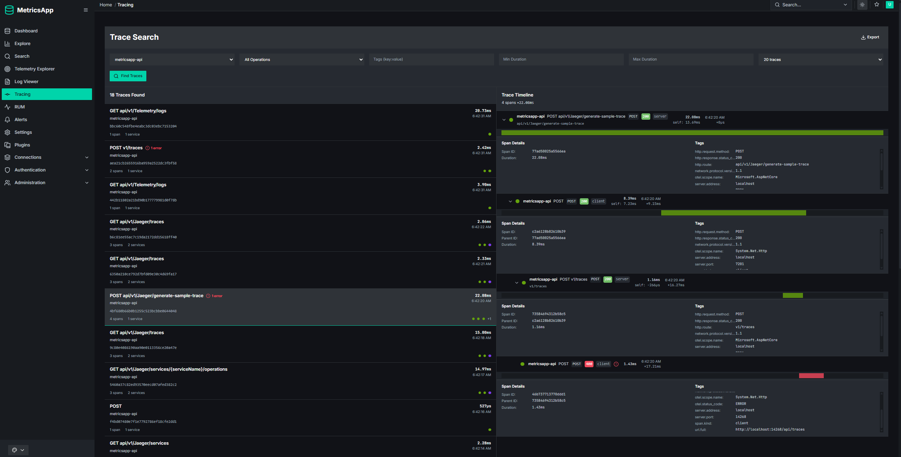

# ASP.NET Core / React Metrics Application

> ⚠️ **Work in Progress**: This project is under active development and is subject to significant changes.

This repository contains the source code for the MetricsApp, a modular application for collecting, storing, and visualizing metrics.

## Primary Projects

The two main entry points for this solution are:

-   **`MetricsApp.Api`**: The backend service that provides a REST API for metric ingestion and querying.
-   **`MetricsApp.WebUI`**: The frontend dashboard for visualizing metrics data.

Given the ongoing development, please refer to the source code for the latest project structure and functionality.

